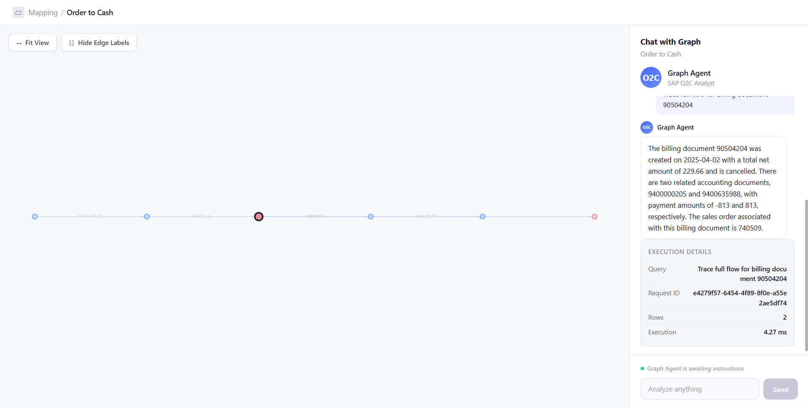
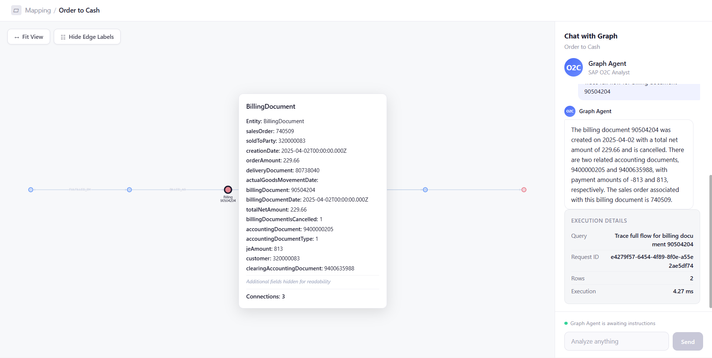

# O2C Insight Engine

A **zero-cost multi-tenant SaaS** that converts natural language questions into SQL queries, executes them against any dataset, and returns both a **natural language answer** and an **interactive graph visualization**. Ships with SAP Order-to-Cash (O2C) as the default dataset — users can upload their own CSV/JSONL/ZIP data or PDF/DOCX documents at any time.

**Default Flow:** SalesOrder → Delivery → Billing → JournalEntry → Payment

**Stack:** Node.js + React + Turso (per-tenant cloud SQLite) + 5 LLM providers + Local embeddings — **100% free tier, zero paid services.**

---

## Quick Start

```bash
# 1. Install dependencies
npm install
cd frontend && npm install && cd ..

# 2. Configure environment
cp .env.example .env
# Add your API keys to .env:
#   GROQ_API_KEY=your_groq_key
#   OPENROUTER_API_KEY=your_openrouter_key
#   NVIDIA_API_KEY=your_nvidia_key
#   CEREBRAS_API_KEY=your_cerebras_key
#   SAMBANOVA_API_KEY=your_sambanova_key
#
# For multi-tenant + auth (optional — system works without these):
#   TURSO_API_TOKEN=your_turso_platform_token
#   TURSO_ORG_SLUG=your_turso_org_name
#   JWT_SECRET=your_stable_secret_string

# 3. Start server (auto-initializes DB on first run)
node server.js

# 4. Start frontend (separate terminal, for development)
cd frontend && npm run dev
```

Open `http://localhost:5173` (dev) or `http://localhost:3000` (production build served by backend).

---

## Architecture

```
┌────────────────────┐     ┌──────────────────────────────────────────────────┐
│   React UI         │     │              Node.js Backend                     │
│  (Vite + Cytoscape)│────▶│  tenantResolver.js (middleware)                   │
│                    │     │    ├─ req.db (per-tenant Turso or global SQLite) │
│  Graph Panel       │◀────│    ├─ req.config (per-tenant dataset config)     │
│  Chat Panel        │     │  queryRoutes.js / documentRoutes.js              │
│  Provider Health   │     │    ├─ queryService.js (orchestrator)              │
│  Upload Modal      │     │    │   ├─ queryClassifier.js (SQL/RAG/HYBRID)    │
│                    │     │    │   ├─ complexityClassifier.js (model routing)│
│                    │     │    │   ├─ promptBuilder.js (schema context)      │
│                    │     │    │   ├─ llmClient.js (5 providers + health)    │
│                    │     │    │   ├─ validator.js (SQL safety)               │
│                    │     │    │   ├─ sqlExecutor.js (tenant DB)              │
│                    │     │    │   ├─ graphExtractor.js (nodes/edges)         │
│                    │     │    │   └─ knowledgeBase.js (RAG context)          │
│                    │     │    ├─ tenantRoutes.js (create/list/delete tenants)│
│                    │     │    ├─ onboarding/ (raw data → config pipeline)    │
│                    │     │    └─ server.js (Express + CORS + security)       │
└────────────────────┘     └──────────────┬───────────────────────────────────┘
                                          │
                    ┌─────────────────────┼─────────────────────┐
                    │                     │                     │
         ┌──────────▼──────────┐ ┌────────▼────────┐ ┌─────────▼─────────┐
         │  Global SQLite      │ │  Turso DB        │ │  Turso DB         │
         │  (dev/tests)        │ │  (Tenant A)      │ │  (Tenant B)       │
         │  sap_otc.db         │ │  Per-tenant cloud│ │  Per-tenant cloud │
         └─────────────────────┘ └─────────────────┘ └───────────────────┘
```

### Directory Structure

```
src/
├── auth/
│   ├── authDb.js            # Shared Turso auth DB (user credentials)
│   ├── authRoutes.js        # Register, login, token verification
│   └── authMiddleware.js    # JWT verification middleware
├── config/
│   ├── activeDataset.js     # Global + per-tenant dataset config management
│   ├── datasetConfig.js     # SAP O2C default config (tables, relationships, keywords)
│   └── datasetValidator.js  # Schema + relationship validation
├── db/
│   ├── connection.js        # Global SQLite connection (dev/tests fallback)
│   ├── tursoAdapter.js      # Turso/LibSQL adapter (matches SQLite async API)
│   ├── tenantRegistry.js    # Tenant → Turso credentials + connection pool
│   ├── init.js              # Schema initialization (accepts db param)
│   ├── loader.js            # JSONL → DB ingestion (SQLite + Turso compatible)
│   └── schema.sql           # 19 tables, indexes, composite keys
├── middleware/
│   └── tenantResolver.js    # Resolves X-Tenant-Id → req.db + req.config
├── onboarding/
│   ├── schemaInference.js   # Auto-detect tables, columns, PKs from JSONL/CSV
│   ├── relationshipInference.js # Suggest joins via column name + value matching
│   └── configGenerator.js   # Generate full config from approved schema
├── query/
│   ├── complexityClassifier.js # SIMPLE/MODERATE/COMPLEX routing
│   ├── queryClassifier.js      # SQL vs RAG vs HYBRID classification
│   ├── promptBuilder.js        # Schema context + few-shot examples for LLM
│   ├── llmClient.js            # 5-provider LLM client with health tracking
│   ├── validator.js            # SQL safety (blocklist, read-only, no subquery JOINs)
│   ├── sqlExecutor.js          # Parameterized execution (tenant-scoped)
│   ├── queryService.js         # Full pipeline orchestrator (accepts db + config)
│   └── graphExtractor.js       # Row → node/edge mapping (O2C + generic)
├── rag/
│   ├── knowledgeBase.js        # Dual-path RAG: vector search + keyword fallback
│   ├── vectorStore.js          # Dual-mode: Turso native vector or in-memory cosine
│   ├── embeddingService.js     # Local HF embeddings (Xenova/all-MiniLM-L6-v2, 384-dim)
│   ├── documentExtractor.js    # Text extraction from PDF, DOCX, TXT, MD
│   ├── chunker.js              # Recursive character text splitter
│   └── zipExtractor.js         # ZIP archive extraction for dataset uploads
├── routes/
│   ├── queryRoutes.js          # REST API endpoints + multer upload
│   ├── documentRoutes.js       # Document upload/list/delete API
│   └── tenantRoutes.js         # Tenant CRUD + Turso auto-provisioning
└── server.js                   # Express server with tenant middleware
frontend/
├── src/
│   ├── App.jsx              # Main component: graph + chat + upload wizard
│   ├── App.css              # Complete UI styling
│   └── index.css            # Base reset
└── package.json
data/
└── tenants.json             # Tenant registry (gitignored — contains auth tokens)
```

---

## Multi-Provider LLM System

The engine uses **5 LLM providers** with dynamic health-based ordering. The healthiest provider is always tried first.

### Provider Priority

| Priority | Provider | Rate Limit | Models |
|----------|----------|------------|--------|
| 1 | **NVIDIA NIM** | 40 RPM | llama-3.1-8b / qwen2.5-coder-32b / llama-3.3-70b |
| 2 | **Cerebras** | 30 RPM | llama3.1-8b / qwen-3-235b |
| 3 | **Groq** | 30 RPM | llama-3.3-70b-versatile |
| 4 | **OpenRouter** | ~200 RPD | llama-3.1-70b-instruct |
| 5 | **SambaNova** | 20 RPD | llama-3.1-8b / Qwen3-32B / llama-3.3-70b |

### Query Complexity Routing

Each query is classified into a complexity level, which determines which model size is used:

| Complexity | Triggers | Model Size |
|------------|----------|------------|
| **SIMPLE** | Single table, basic listing, count | Small (8B params) |
| **MODERATE** | Multi-table, filters, aggregation | Medium (32B params) |
| **COMPLEX** | Trace flows, multi-hop JOINs, gap analysis | Large (70B+ params) |

### Health Tracking

The system parses rate limit headers (`x-ratelimit-remaining-requests-minute`, `x-ratelimit-remaining-tokens-minute`) from each provider response to maintain real-time health scores:

- **Base score:** 100
- **Recent success:** +10
- **Low remaining requests:** -10 to -200
- **Consecutive failures:** -30 per failure
- **Cooldown:** 1 minute after 3 consecutive failures

Providers are re-sorted before every LLM call. The `/api/providers` endpoint exposes current health status.

### Fallback Chain

```
Provider 1 (healthiest) → Provider 2 → ... → Provider 5 → Fallback SQL → Error + Suggestions
```

**Fallback SQL** is a last-resort keyword-to-table SQL generator that produces basic `SELECT` queries without LLM involvement. If even that fails, pre-built query suggestions are returned.

---

## Query Classification

Every query passes through a 3-way classifier before processing:

| Type | Handling | Example |
|------|----------|---------|
| **SQL** | LLM generates SQL → execute → graph | "Show all sales orders" |
| **RAG** | Knowledge base lookup (no SQL) | "What is order to cash?" |
| **HYBRID** | SQL execution + RAG context enrichment | "Why is the billing document not cleared?" |
| **INVALID** | Rejected before any LLM call | "What is the capital of France?" |

---

## Graph Modeling

The system models SAP Order-to-Cash as a **directed graph of business documents**.

### Core Nodes
- **Customer** — Business partner who initiates the order
- **Sales Order** — Purchase request from the customer
- **Delivery** — Physical shipment of goods
- **Billing Document** — Invoice generated for the delivery
- **Journal Entry** — Financial posting in accounts receivable
- **Payment** — Cash receipt clearing the journal entry

### Edge Types (Relationships)
| Edge | From → To | Meaning |
|---|---|---|
| ORDERED | Customer → SalesOrder | Customer placed the order |
| FULFILLED_BY | SalesOrder → Delivery | Order shipped |
| BILLED_AS | Delivery → BillingDocument | Shipment invoiced |
| POSTED_AS | BillingDocument → JournalEntry | Invoice posted to accounting |
| CLEARED_BY | JournalEntry → Payment | Payment received |
| BILLED_TO | BillingDocument → Customer | Invoice sent to customer |

---

## Demo

### Graph Visualization


### Node Tooltip


---

## Example Queries

| Query Type | Example |
|---|---|
| **Full Trace** | Trace full flow for billing document 90504204 |
| **Broken Flows** | Find sales orders that were delivered but not billed |
| **Aggregation** | Which products have the most billing documents? |
| **Customer Lookup** | Show all orders for customer 320000083 |
| **Reverse Trace** | Find journal entry for billing document 90504248 |
| **Cancelled Docs** | Show all cancelled billing documents |
| **Missing Links** | Show billing documents without journal entry |
| **Top-N** | Top 5 customers by total billing amount |
| **Conceptual** | What is order to cash? |
| **Process** | Describe the billing process |

---

## Key Design Decisions

| Decision | Rationale |
|---|---|
| **SQLite over Neo4j/Graph DB** | Zero-config local development; raw JSONL data maps directly to relational tables; 18+ targeted indexes make multi-hop joins fast (~3-6ms) |
| **Raw SQL over ORM** | Full control over precise 5-table JOIN chains; ORMs generate unpredictable queries that conflict with prompt engineering |
| **Billing item padding at ingestion** | Critical data fix: raw data has unpadded "10" vs zero-padded "000010" — 0/245 direct matches, 245/245 after padding |
| **All columns TEXT** | SAP identifiers have leading zeros (e.g., customer "0000100017") — numeric types would silently strip them |
| **Two LLM calls per query** | 1st: NL → SQL generation. 2nd: SQL results → NL answer. Separation ensures deterministic data + readable output |
| **5 providers with health tracking** | Maximizes availability on free-tier API keys; dynamic ordering ensures fastest healthy provider is always used first |
| **Complexity-based model routing** | Simple queries use small fast models (8B); complex trace queries use large models (70B+) — saves tokens and reduces latency |
| **Response caching** | 5-minute TTL cache keyed by normalized query + dataset — eliminates redundant LLM calls for repeated questions |
| **Generic dataset support** | Config-driven architecture allows any JSONL/CSV dataset to be onboarded via raw upload or JSON config |

---

## Safety & Guardrails

### Multi-Layer Protection

1. **Query Classification** — SQL/RAG/HYBRID/INVALID routing before any LLM call
2. **Intent Validation** — Rejects queries without recognizable business action words (50+ allowed intent verbs)
3. **Domain Guardrails** — Requires at least one dataset domain keyword; blocks off-topic questions
4. **SQL Blocklist** — Rejects DELETE, UPDATE, DROP, ALTER, PRAGMA, load_extension, ATTACH
5. **Read-Only Enforcement** — Only SELECT statements pass validation
6. **Subquery Block** — No nested SELECT inside JOIN conditions (prevents cartesian explosions)
7. **LIMIT 100 Enforcement** — Auto-appended if missing from LLM output
8. **SQL Length Limit** — Generated SQL capped at 3000 characters
9. **Execution Timeouts** — LLM: 45s per provider, DB: 5s, NL Answer: 50s
10. **Payload Truncation** — Max 100 rows in API response, max 200 graph nodes
11. **ID Existence Checks** — Pre-validates document and customer IDs before executing the main query
12. **Rate Limiting** — 50 requests per minute per IP
13. **Raw SQL Rejection** — Queries starting with SELECT/INSERT/UPDATE/DROP are blocked at the API layer

### Fallback Mechanisms

| Mechanism | Trigger | Action |
|---|---|---|
| **Provider Failover** | LLM error or timeout | Try next healthiest provider (up to 5) |
| **LEFT JOIN Retry** | Flow query returns 0 rows | Relax INNER JOINs to LEFT JOINs and retry |
| **Fallback SQL** | All 5 LLM providers fail | Generate basic SQL from keyword-to-table matching |
| **Suggested Queries** | Fallback SQL also fails | Return pre-built query examples for the active dataset |
| **NL Answer Degradation** | NL generation fails | Return metadata summary instead of NL answer |
| **Orphan Node Removal** | Graph has disconnected nodes | Filter nodes with zero edges from flow queries |
| **Rule-Based Bypass** | Simple "show all X" queries | Skip LLM entirely, generate SQL from pattern matching |

---

## Dataset Onboarding

The system supports two ways to load datasets:

### 1. Config Upload (Technical Users)
Upload a JSON config file with `name`, `tables`, `relationships`, and `domainKeywords`. Full schema control.

### 2. Raw Data Upload (Non-Technical Users)
Upload JSONL, CSV, or ZIP files through a multi-step wizard:

1. **Upload** — Drop files (including ZIP archives containing multiple CSV/JSONL files), system auto-detects format
2. **Schema Review** — Edit inferred table names, columns, primary keys
3. **Relationship Review** — Accept/reject suggested joins with confidence scores
4. **Confirm** — Name the dataset, system generates config and loads data

The onboarding pipeline uses deterministic heuristics (no LLM) for schema and relationship inference:
- **Primary key detection:** All-unique non-null columns, preferring `*Id`/`*Key`/`*Code` suffixes
- **Relationship scoring:** Column name matching (+0.5), suffix pattern matching (+0.3), value overlap sampling (+0.5)
- **Cardinality inference:** 1:1, 1:N, N:1, N:M from value distribution analysis

### Dynamic Adaptation

The entire query pipeline adapts automatically to any uploaded dataset:

| Component | How it adapts |
|-----------|---------------|
| **SQL prompts** | Built from active config (tables, columns, relationships, keywords) |
| **Query classification** | Uses `domainKeywords` from config (auto-generated from table/column names) |
| **Complexity routing** | Generic regex patterns, no dataset-specific logic |
| **Graph extraction** | Reads relationships from config to build nodes/edges dynamically |
| **NL answers** | LLM prompt references active dataset name, not hardcoded |
| **ID validation** | Checks primary keys from config tables |
| **Suggested queries** | Auto-generated from table display names |
| **RAG context** | Vector search from uploaded documents; keyword KB only for default O2C dataset |

---

## Document RAG Pipeline

The system supports uploading unstructured documents (PDF, DOCX, TXT, MD) to enhance the knowledge base. No additional API keys are needed — embeddings are generated locally.

### Pipeline Flow

```
Upload Document → Extract Text → Chunk (500 chars, 50 overlap) → Embed (384-dim) → Store in SQLite
```

### Retrieval (Dual-Path)

When a RAG or HYBRID query comes in:

1. **Vector search** — If documents exist, embed the query and find top-5 chunks by cosine similarity (threshold ≥ 0.3)
2. **Keyword fallback** — If no documents are uploaded or vector search returns nothing, fall back to the curated 10-entry SAP O2C knowledge base

### Technical Details

| Component | Implementation |
|-----------|---------------|
| **Embedding model** | Xenova/all-MiniLM-L6-v2 (384-dim, ONNX/WASM via @huggingface/transformers) |
| **Text extraction** | pdf-parse (PDF), officeparser (DOCX), fs.readFile (TXT/MD) |
| **Chunking** | Recursive character splitter with separator hierarchy: `\n\n` → `\n` → `. ` → ` ` |
| **Vector store** | Turso: F32_BLOB(384) with DiskANN index / SQLite: JSON embeddings |
| **Search** | Turso: `vector_top_k()` indexed search → `vector_distance_cos()` fallback → In-memory JS cosine |
| **Persistence** | Document tables survive dataset switches and redeploys |

---

## Multi-Tenancy

The system supports per-tenant database isolation using **Turso** (managed SQLite). Each tenant gets their own cloud database — datasets, documents, and query cache are fully isolated.

### How It Works

```
New user → Register (email + password) → bcrypt hash stored in shared auth DB →
Turso tenant DB auto-provisioned → O2C data loaded (background) →
JWT token returned → all requests authenticated via Authorization header
```

### Tenant Resolution

| Request State | Behavior |
|---------------|----------|
| No `X-Tenant-Id` header | Uses global SQLite (dev/tests) |
| Header + unregistered tenant | Falls back to global SQLite |
| Header + registered tenant | Uses tenant's Turso DB (strict isolation) |

### Auto-Provisioning

When `TURSO_API_TOKEN` and `TURSO_ORG_SLUG` are configured:
- New tenants get a Turso database created via Platform API
- Auth tokens generated automatically
- Default O2C dataset loaded in background (non-blocking)
- Response returns immediately — user can query while initialization completes

### Tenant-Scoped Features

| Feature | Isolation |
|---------|-----------|
| **Database** | Per-tenant Turso DB (separate cloud instance) |
| **Dataset config** | Per-tenant config stored in memory |
| **Response cache** | Cache keys prefixed with tenant ID |
| **Documents/RAG** | Document chunks stored in tenant's DB |
| **Dataset upload** | Replaces data in tenant's DB only |

### Authentication

| Method | Path | Description |
|--------|------|-------------|
| `POST` | `/api/auth/register` | Create account (email + password) → provisions Turso DB → returns JWT |
| `POST` | `/api/auth/login` | Verify credentials → returns JWT (contains tenantId) |
| `GET` | `/api/auth/me` | Verify token → returns user email + tenantId |

- **Password storage:** bcrypt hash (cost factor 10) in shared Turso auth DB
- **Token:** JWT with 30-day expiry, contains `{ email, tenantId }`
- **Auth DB:** Single shared Turso database (`o2c-auth`) — separate from tenant data DBs

### Tenant API

| Method | Path | Description |
|--------|------|-------------|
| `POST` | `/api/tenants` | Create tenant (auto-provisions Turso DB) |
| `GET` | `/api/tenants` | List all tenants |
| `DELETE` | `/api/tenants/:id` | Delete tenant + destroy Turso DB |

---

## Frontend Features

- **Dual-Pane Layout** — Graph panel (left, ~70%) + Chat panel (right, 420px)
- **Conversational Chat** — Full conversation history with user/agent message bubbles
- **Natural Language Answers** — AI-generated human-readable answers
- **Interactive Graph** — Click nodes to see tooltip with all properties; drag tooltips anywhere
- **Dynamic Welcome Examples** — Clickable example queries based on active dataset
- **Provider Health Indicator** — Real-time status dot showing how many AI providers are healthy
- **Progressive Disclosure** — Clean chat by default; "View details" expands query plan, performance metrics, and data sources
- **Query Metadata Badges** — Color-coded badges for query type (SQL/RAG/HYBRID), complexity (SIMPLE/MODERATE/COMPLEX), execution plan (LLM/RULE_BASED/FALLBACK), and confidence level
- **Context Line** — "Based on X records from your dataset" / "From knowledge base"
- **Suggestion Chips** — When an invalid ID is entered or all LLMs fail, clickable alternatives are shown
- **Authentication** — Email + password signup/login with JWT tokens; logout button in navbar
- **Auto-Tenant Provisioning** — Registration auto-creates a per-tenant Turso cloud database
- **Dataset Upload Wizard** — Three-tab modal: config upload, raw data onboarding (with ZIP support), and document management
- **Document RAG Upload** — Upload PDF/DOCX/TXT/MD documents to enhance the knowledge base; view and delete uploaded documents
- **Show SQL Toggle** — Developer mode to see generated SQL
- **Fit View / Hide Labels** — Floating graph controls
- **Loading States** — Animated dot pulse during query processing
- **Error Boundary** — Graceful crash recovery with refresh option

---

## API Reference

### GET /api/health
Health check. Returns `{ status: "ok", dataset: "sap_o2c" }`.

### GET /api/dataset
Returns active dataset metadata: name, tables (with columns/PKs), relationships, counts.

### GET /api/providers
Returns real-time health status for all 5 LLM providers: scores, remaining requests/tokens, cooldown state, last errors.

### POST /api/query

**Request:**
```json
{
  "query": "Trace full flow for billing document 90504204",
  "includeSql": true
}
```

**Response:**
```json
{
  "success": true,
  "requestId": "uuid",
  "traceId": "uuid",
  "dataset": "sap_o2c",
  "queryType": "SQL",
  "complexity": "COMPLEX",
  "executionPlan": "LLM",
  "queryPlan": {
    "type": "MULTI_HOP_TRACE",
    "tablesUsed": ["Sales Order", "Billing Document", "Journal Entry (AR)", "Payment (AR)"],
    "joinPath": [
      { "from": "sales_order_headers.salesOrder", "to": "outbound_delivery_items.referenceSdDocument", "label": "FULFILLED_BY", "joinType": "INNER" }
    ],
    "reasoning": "Traversed 4 relationship(s) across 7 table(s): FULFILLED_BY → BILLED_AS → POSTED_AS → CLEARED_BY"
  },
  "confidence": 1.0,
  "confidenceLabel": "High",
  "confidenceReasons": ["Valid SQL generated", "No fallback used", "Non-empty results (2 rows)"],
  "dataConfidence": { "level": "HIGH", "reason": "Multi-hop query across 4 joins — all stages connected" },
  "metrics": { "totalTimeMs": 12829, "sqlTimeMs": 34.12, "llmTimeMs": 12794.88 },
  "resultStatus": null,
  "rowCount": 2,
  "executionTimeMs": 34.12,
  "nlAnswer": "Billing document 90504204 traces back to sales order...",
  "summary": "...",
  "sql": "SELECT ...",
  "explanation": {
    "intent": "trace",
    "entities": ["billing", "sales order", "delivery"],
    "strategy": "multi-hop join across O2C flow",
    "explanationText": "The system identified this as a trace query and..."
  },
  "graph": { "nodes": [...], "edges": [...] },
  "highlightNodes": ["BILL_90504204"],
  "data": [...]
}
```

### POST /api/dataset/upload
Upload a JSON config to switch datasets.

### POST /api/dataset/upload/raw
Upload raw JSONL/CSV/ZIP files for schema inference. Returns `sessionId`, inferred `schema`, and `relationships`. ZIP files are automatically extracted and their contents processed alongside individual files.

### POST /api/dataset/upload/confirm
Confirm onboarding session with user-edited schema/relationships to load the dataset.

### POST /api/documents/upload
Upload a document (PDF, DOCX, TXT, MD) for the RAG knowledge base. Extracts text, chunks it, generates embeddings locally using Hugging Face Transformers.js (Xenova/all-MiniLM-L6-v2), and stores chunks with 384-dim vectors in SQLite. Returns `{ documentId, title, chunkCount }`.

### GET /api/documents
List all uploaded documents with chunk counts and metadata.

### DELETE /api/documents/:id
Delete a document and all its chunks from the vector store.

### POST /api/tenants
Create a new tenant. If `TURSO_API_TOKEN` is configured, auto-provisions a Turso cloud database. Otherwise requires `tursoUrl` + `authToken` in the request body. Database initialization runs in background — user can query immediately via global fallback.

### GET /api/tenants
List all registered tenants with initialization status.

### DELETE /api/tenants/:id
Delete a tenant and destroy their Turso database (if Turso API is configured).

---

## Default Dataset

Ships with 19 JSONL tables from SAP S/4HANA Order-to-Cash process (users can upload any dataset via the wizard):
- **10 Transactional:** sales_order_headers/items, outbound_delivery_headers/items, billing_document_headers/items/cancellations, journal_entry_items, payments, schedule_lines
- **9 Master Data:** business_partners, addresses, customer_company/sales_area_assignments, products, product_descriptions, plants, product_plants, product_storage_locations

---

## Hallucination Prevention

All responses are **grounded in executed SQL results**. The system does not generate answers without data backing.

| Layer | Mechanism |
|---|---|
| **Classification** | Query classified as SQL/RAG/HYBRID/INVALID before any LLM call |
| **Pre-LLM** | Intent + domain validation rejects off-topic queries |
| **SQL Generation** | Prompt includes exact schema, validated joins, and few-shot examples |
| **Post-LLM** | Generated SQL validated against safety blocklist; only SELECT allowed |
| **Execution** | SQL runs against real data — 0 rows = "no data found", not fabrication |
| **NL Answer** | Second LLM call receives actual query results as input |
| **ID Checks** | Document IDs verified against database before query execution |
| **RAG Grounding** | Knowledge base answers sourced from uploaded documents (vector search) or curated domain content (keyword fallback) |

---

## Observability

Every query is assigned a unique `traceId` (UUID v4) that appears in:
- Server console logs (with tenant, provider used, model, complexity, SQL, execution time, row count)
- API response payload (`traceId` + `requestId`)
- Provider health tracking (success/failure per provider)
- Timing metrics (`metrics.totalTimeMs`, `metrics.sqlTimeMs`, `metrics.llmTimeMs`)

Example server log:
```
[API-4ce9...] [USER_QUERY] "Trace full flow for billing document 90504204"
[API-4ce9...] [QUERY_TYPE] SQL
[API-4ce9...] [COMPLEXITY] COMPLEX
[LLM] Provider order: NVIDIA(100) → Cerebras(100) → Groq(100) → OpenRouter(100) → SambaNova(100)
[LLM] Attempting NVIDIA (meta/llama-3.3-70b-instruct) for COMPLEX query...
[LLM] NVIDIA success. [Remaining: req=Infinity, tok=Infinity]
[API-4ce9...] [SQL_GENERATED] SELECT DISTINCT ...
[API-4ce9...] [VALIDATION] SQL passed safety checks.
[API-4ce9...] [EXECUTION] 2 rows fetched in 2.90ms
[API-4ce9...] [RESULT] rowCount=2 | confidence=1 | execTime=2.9ms
```

---

## Zero-Cost Architecture

Every component runs on free-tier services — no credit card required.

| Component | Service | Free Tier |
|-----------|---------|-----------|
| **Hosting** | Render | Free web service |
| **Database** | Turso (per-tenant cloud SQLite) | 500 DBs, 9GB, 25M reads/month |
| **Vector Search** | Turso native (F32_BLOB + DiskANN) | Included in Turso free tier |
| **Embeddings** | HuggingFace Transformers.js (local) | No API calls, runs on server |
| **LLM Providers** | NVIDIA, Cerebras, Groq, OpenRouter, SambaNova | Free-tier API keys |
| **Auth** | Email + password + JWT | bcrypt + jsonwebtoken (no auth service) |
| **Auth DB** | Turso (shared `o2c-auth`) | Included in Turso free tier |
| **File Storage** | Turso (documents stored as chunks) | Included in Turso free tier |

---

## Limitations

- **LLM Non-Determinism** — SQL generation may occasionally vary across runs; few-shot examples mitigate but don't fully eliminate this
- **No Conversation Memory** — Each query is independent; follow-up questions don't have prior context
- **Turso Free Tier** — 500 databases, 9GB storage, 25M row reads/month. Sufficient for demos and small-scale usage
- **Free-Tier Rate Limits** — Provider availability depends on remaining API quota; complex queries may fail during rate limit windows
- **Fallback SQL** — Keyword-to-table matching can only produce simple SELECT queries, not multi-hop JOINs
- **No Password Reset** — Email + password auth is implemented, but no forgot password / reset flow yet
- **First 60s After Deploy** — New tenants use global SQLite while Turso DB initializes in background; fully transparent to the user

---

## Testing

```bash
# Start the server first
node server.js

# Run the full 30-test API suite
node test-api.js
```

The test suite covers validation, guardrails, RAG, SQL generation, aggregation, ID checks, dataset upload, and response shape verification. Expected: 29-30/30 (1 test depends on LLM availability for complex trace queries).
